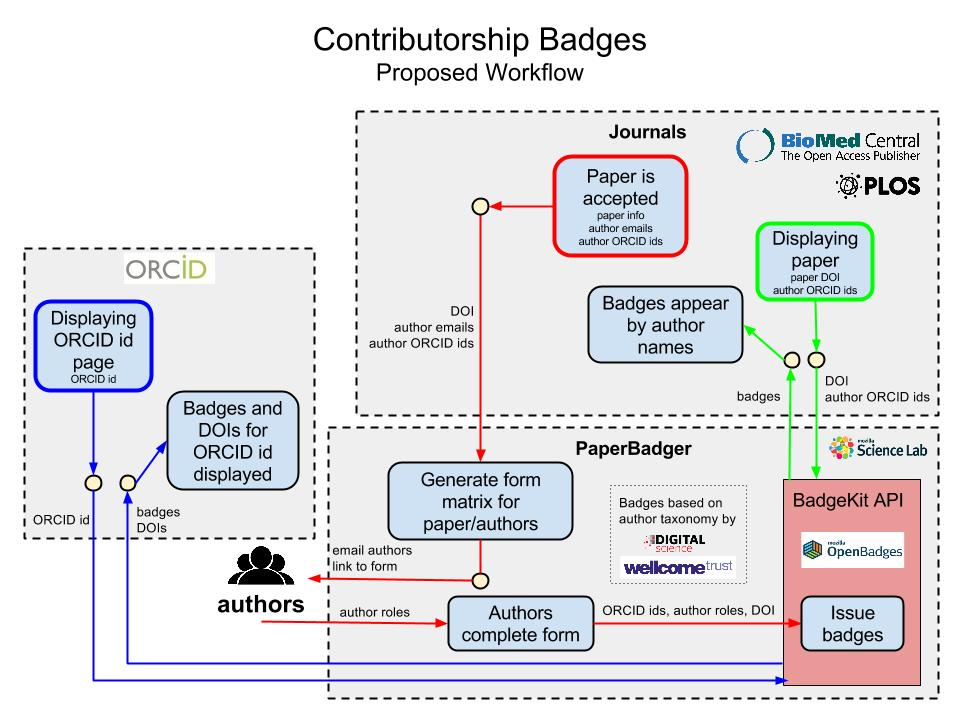

# PaperBadger 

Exploring the use of digital badges for crediting contributors to scholarly papers for their work

As the research environment becomes more digital, we want to test how we can use this medium to help bring transparency and credit for individuals in the publication process.

This work is a collaboration with publishers [BioMed Central](http://www.biomedcentral.com/) (BMC) and the [Public Library of Science](http://www.plos.org/) (PLoS); the biomedical research foundation, [The Wellcome Trust](http://www.wellcome.ac.uk/); the software and technology firm [Digital Science](http://www.digital-science.com/); the registry of unique researcher identifiers, [ORCID](http://orcid.org/); and the [Mozilla Science Lab](http://mozillascience.org/).

### Getting Started

#### Project Setup

1. Clone PaperBadger and enter the directory: `git clone https://github.com/mozillascience/PaperBadger && cd PaperBadger`
2. Install PaperBadger's Node dependencies: `npm install`
3. Copy the configuration template to its expected location: `cp env.dist .env`
4. Open `.env` in your favourite text editor and ensure that your `PORT`, `SESSION_SECRET`, `BADGES_ENDPOINT`, `BADGES_KEY`, `BADGES_SECRET`, `BADGES_SYSTEM`, `ORCID_AUTH_CLIENT_ID`, `ORCID_AUTH_CLIENT_SECRET`, `ORCID_AUTH_SITE`, `ORCID_AUTH_TOKEN_PATH` and `ORCID_REDIRECT_URI` environment variables are set to the correct values. `PORT` can be any available port. Run `source .env`.
If you would like to develop against the hosted custom badgekit-api we have running specificaly for PaperBadger testing, your environment values should look this:

        # default port is 5000
        export PORT=5000
        export SESSION_SECRET=USE_SOMETHING_GOOD_LIKE_puUJjfE6QtUnYryb
       
        # Badges
        export BADGES_ENDPOINT=http://badgekit-api-sciencelab.herokuapp.com/
        export BADGES_KEY=master
        export BADGES_SECRET=#############
        export BADGES_SYSTEM=badgekit
        
        # ORCID Auth
        export ORCID_AUTH_CLIENT_ID=#############
        export ORCID_AUTH_CLIENT_SECRET=#############
        export ORCID_AUTH_SITE=#############
        export ORCID_AUTH_TOKEN_PATH=#############
        export ORCID_REDIRECT_URI=#############

Ask @acabunoc for ones marked `###########`. Our custom BadgeKit API code can be found [here](https://github.com/acabunoc/badgekit-api).

5. Run `npm start`, and open up `http://localhost:5000/` in your favourite web browser!

### Contributing

[Project Roadmap: #17](https://github.com/mozillascience/paperbadger/issues/17)

Please review our contributing guidelines [here](CONTRIBUTING.md)

Want to help? Drop us a line in [this issue](https://github.com/mozillascience/PaperBadger/issues/2).

### API Endpoints

*   GET [/badges](http://paperbadger.herokuapp.com/badges)
    *   Get all badges we issue
*   GET /badges/:badge
    *   Get all badge instances of a certain badge
    *   e.g. [/badges/formal_analysis](http://paperbadger.herokuapp.com/badges/formal_analysis)
*   GET /users/:orcid/badges
    *   Get all badge instances earned by a user
    *   e.g. [/users/0000-0003-4959-3049/badges](http://paperbadger.herokuapp.com/users/0000-0003-4959-3049/badges)
*   GET /users/:orcid/badges/:badge
    *   Get all badge instances of a certain badge earned by a user
    *   e.g. [/users/0000-0003-4959-3049/badges/investigation](http://paperbadger.herokuapp.com/users/0000-0003-4959-3049/badges/investigation)
*   GET /papers/:doi1/:doi2/badges (not implemented)
    *   Get all badge instances for a paper.
*   GET /papers/:doi1/:doi2/badges/:badge
    *   Get all badge instances of a certain badge for a paper.
    *   e.g. [/papers/10.1371/journal.pbio.1002126/badges/investigation](http://paperbadger.herokuapp.com/papers/10.1371/journal.pbio.1002126/badges/investigation)
*   GET /papers/:doi1/:doi2/badges/:orcid/badges
    *   Get all badge instances earned by a user for a paper.
    *   e.g. [/papers/10.1371/journal.pbio.1002126/users/0000-0003-4959-3049/badges](http://paperbadger.herokuapp.com/papers/10.1371/journal.pbio.1002126/users/0000-0003-4959-3049/badges)
*   GET /papers/:doi1/:doi2/badges/:orcid/badges/:badge
    *   Get all badge instances of a certain badge earned by a user for a paper.
    *   e.g. [/papers/10.1371/journal.pbio.1002126/users/0000-0003-4959-3049/badges/investigation](http://paperbadger.herokuapp.com/papers/10.1371/journal.pbio.1002126/users/0000-0003-4959-3049/badges/investigation)
*   POST /papers/:doi1/:doi2/badges/:orcid/badges/:badge
    *   Issue a badge
